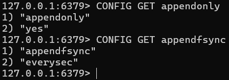
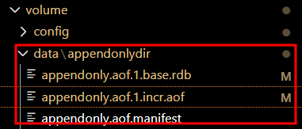
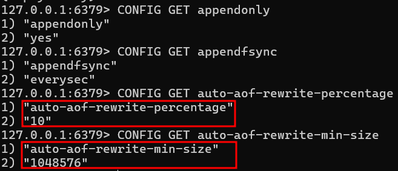
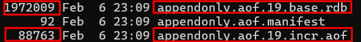

# Redis Persistence AOF

## 목적

- 일반적인 Redis 서버는 메모리 기반이라 장애 발생 시 기록됬던 데이터가 사라진다.
- AOF의 Persistence 기능을 이용하여 Write되는 데이터를 백업해 데이터 소멸을 방지한다.
- Redis가 재기동 됬을 때 AOF를 이용해 Redis 서버의 마지막 상태로 복구한다.

## 특징

- Redis의 Persistence 기능 중 하나로, 쓰기(Write) 연산을 순차적으로 로그 파일에 기록하여 장애 발생 시 데이터 복구 목적으로 사용된다.
- SET, HSET, LPUSH 같이 변경이 발생하는 모든 쓰기(Write) 연산을 AOF 로그 파일에 저장된다.
- Redis가 재기동 될 때, AOF 파일을 읽어서 기록된 명령어를 순차적으로 실행하여 데이터를 복구한다.

### AOF fsync

- 동기화 옵션 (fsync 모드) => always : 매번 fsync()를 호출하여 데이터 유실은 최소화 되지만 성능이 저하된다.
- 동기화 옵션 (fsync 모드) => everysec : 1초 주기로 fsync()를 호출하여 데이터 유실과 성능 저하의 균형을 이룬다.
- 동기화 옵션 (fsync 모드) => no : OS가 임의로 디스크에 기록하도록 위임하여 속도는 가장 빠르나 일부 데이터 유실 가능성이 존재한다.

### RDB vs AOF

- RDB(Snapshot) 방식 대비 더 높은 데이터 복구 안정성을 가지며, 보통 데이터 손실을 최소화 해야 하는 환경에서 사용된다.
- AOF와 RDB를 동시에 병행하면 데이터 안정성과 성능을 조절 가능하다.
- AOF는 모든 명령어를 기록하므로 RDB 대비 속도가 느리다.
- 단순 쓰기 연산이 많은 경우에는 RDB 단독 사용이 유리하고, 데이터 유실을 최소화 해야 하는 경우면 AOF 병행 사용이 필수다.

### Rewrite

- AOF 파일의 크기가 너무 커지면 어느 순간에 성능 저하가 발생할 수 있다. 때문에 Rewrite를 통해서 리팩토링 과정이 필요하다.
- 증분되는 명령어 데이퇴는 .aof 파일로 관리딘다.
- Rewrite가 수행되면 최적화된 데이터는 스냅샷으로 .rdb 파일로 관리된다.
- Rewirte될 때마다 .aof 및 .rdb 파일명에는 버전 넘버링이 갱신된고 해당 파일명은 manifest 파일에 갱신된다.

### Replication

- Redis 복제(replication) 환경에서 AOF를 사용하여 Master-Slave 간 데이터 일관성을 유지할 수 있다.
- Master에서는 AOF 활성화 Slave는 read-only로 운영하여 안정적인 데이터 제공이 가능하다.

## 설정

### AOF

```
appendonly yes
appendfsync everysec
```

```
CONFIG GET appendonly
CONFIG GET appendfsync
```





### Rewrite

### Rewrite 기능 redis.conf에 설정

```
auto-aof-rewrite-percentage 100
auto-aof-rewrite-min-size 64mb
```

### Rewrite 기능 적용 여부 확인

```
CONFIG GET appendonly
CONFIG GET appendfsync
CONFIG GET auto-aof-rewrite-percentage
CONFIG GET auto-aof-rewrite-min-size
```

### 수동 Rewrite

```
BGREWRITEAOF
```



