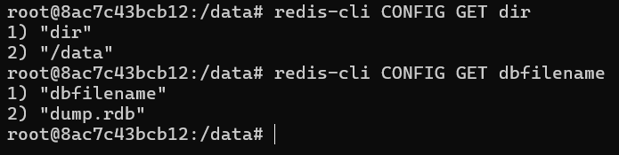
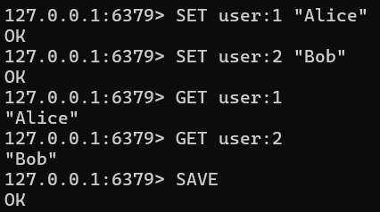
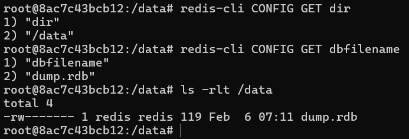
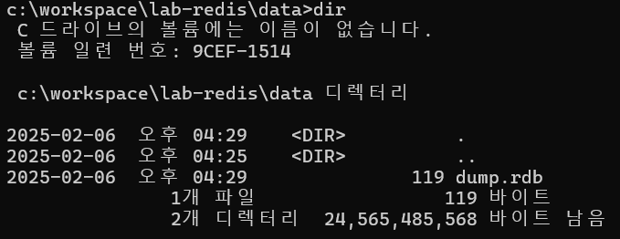
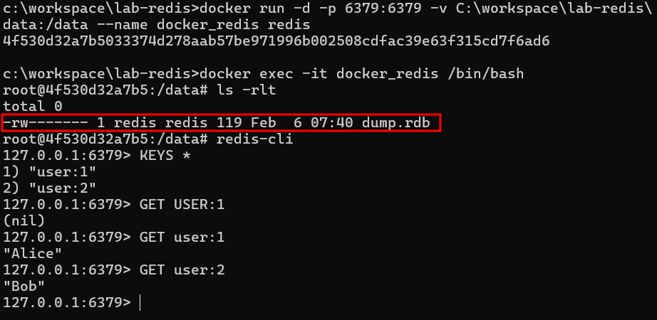

# Redis Persistence RDB

## 특징

- Redis가 지원하는 Persistence 메커니즘 중 하나다.
- RDB는 주기 별로 특정 시점의 데이터를 스냅샷으로 디스크에 저장하는 방식을 말한다.
- RDB는 빠른 백업 및 복구에 유리하다.
- RDB는 데이터 자체를 파일로 떠버리는 방식이기 때문에 AOF 방식보다 디스크 I/O 부담이 적다.
- RDB의 저장 주기 시점과 엇나가게 Redis 서버가 다운될 경우 일정 데이터의 유실 가능성이 있다.
- 설정을 통해 특정 조건에만 스냅샷을 저장하도록 조정 가능하다.
- 자주 변경되는 데이터가 많으면 짧은 스냅샷 생성 주기를 권장한다.
- 트랜잭션이 중요한 서비스는 AOF와 함께 사용을 권장한다.
- 대규모 데이터 처리 서비스에서는 AOF와 함께 사용하는 경우가 많다.
- 클러스터 환경에서 RDB 백업이 필요하다면 slave 노드에서 수행하며 master 노드의 성능 저하를 방지한다.

## RDB 스냅샷 주기 설정

### redis.conf

```
save 900 1  # 900초(15분) 동안 최소 1개의 키 변경 시 스냅샷 저장
save 300 10  # 300초(5분) 동안 10개 이상 키 변경 시 저장
save 60 10000  # 60초 동안 10,000개 이상 변경 시 저장
```

## RDB 파일 생성 위치 조회

```
redis-cli CONFIG GET dir
redis-cli CONFIG GET dbfilename
```



## RDB 파일 즉시 백업

```
SET user:1 "Alice"
SET user:2 "Bob"
SAVE
```







## 설정 주기에 따라 RDB 파일 생성

### redis.conf

```
bind 0.0.0.0

port 6379

dbfilename backup.rdb

save 60 3

slave-read-only no
```

## RDB 파일로 데이터 복원

