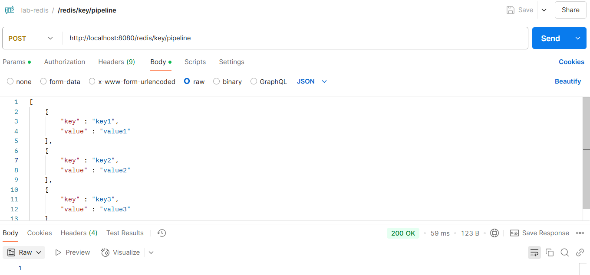
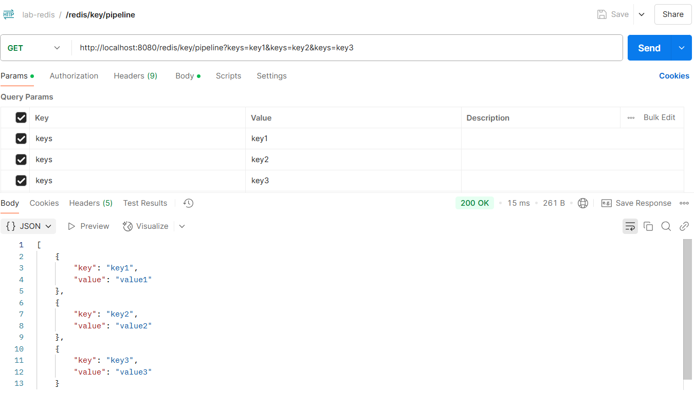

# Redis Pipelining

## 목적

- 한 번의 연결에 여러 건의 데이터를 동시에 set/get하여 네트워크 I/O를 최소화하기 위함.

## 특징

- 여러 개의 Redis 명령어를 한 번에 서버로 전송하고 응답도 한 번에 받는 방식.
- 네트워크 I/O 횟수를 줄여 성능 개선에 목적을 둔다.
- 트랜잭션처럼 연속된 명령어를 사용해야 할 때 유용하다.
- 배치처리처럼 다량의 데이터를 밀어 넣을 때 유용하다.
- 파이프라이닝시 한 번에 너무 많은 요청을 하게 되면 Redis 메모리가 급격하게 증가할 수 있기 때문에 적절히 나눠 배치 처리를 하는걸 권장한다.
- 파이프라이닝시 요청 순서 대로 응답을 받기 때문에 응답을 개별 처리 해야 할 때 주의해야 한다.
- 파이프라이닝은 트랜잭션과 다르게 요청 중 일부가 실패할 수 있다.

## Spring Boot & Redis

### set pipeline

```
public List<Object> addKeyPipeline(List<KeyAddRequest> request) {
    return redisTemplate.executePipelined((RedisCallback<Object>) connection -> {
        StringRedisConnection stringRedisConnection = (StringRedisConnection) connection;
        request.forEach((r) -> stringRedisConnection.set(r.getKey(), r.getValue()));
        return null;
    });
}
```



### get pipeline

```
public List<KeyResponse> getKeyPipeline(List<String> keys) {
    List<Object> values = redisTemplate.executePipelined((RedisCallback<String>) connection -> {
        StringRedisConnection stringRedisConnection = (StringRedisConnection) connection;
        keys.forEach(k -> stringRedisConnection.get(k));
        return null;
    });
    
    return IntStream.range(0, keys.size())
            .mapToObj(i -> KeyResponse.build(keys.get(i), (String) values.get(i)))
            .collect(Collectors.toList());
}
```

