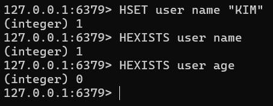

# Redis 데이터 타입 Hash 처리

HASH 데이터 타입은 하나의 키 아래 여러 개의 필드-값을 저장할 수 있다.

## 데이터 추가

```
HSET user name "KIM" age 29 country "KR"
HGET user name
HGET user age
HGET user country
```


## 데이터 삭제

```
HSET user name "KIM" age 29 country "KR"
HLEN user
HDEL user name
HLEN user
HDEL user age
HLEN user
HDEL user country
HLEN user
```


## 데이터 조회

```
HSET user name "KIM" age 29 country "KR"

HGET user name
HGET user age
HGET user country

HGETALL user

HKEYS user

HVALS user
```


## 필드 개수 조회

```
HLEN user
HSET user name "KIM"
HLEN user
HSET user age 29
HLEN user
HSET user country "KR"
HLEN user
```


## 필드 존재 여부 확인

```
HSET user name "KIM"
HEXISTS user name
HEXISTS user age
```

