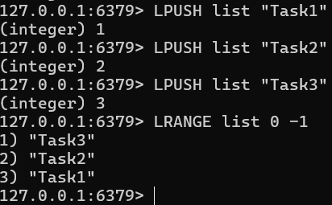
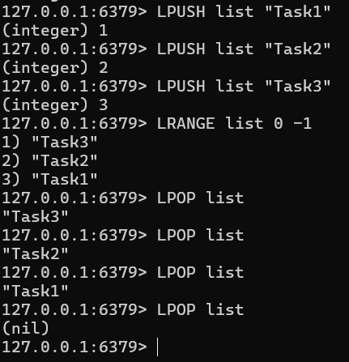
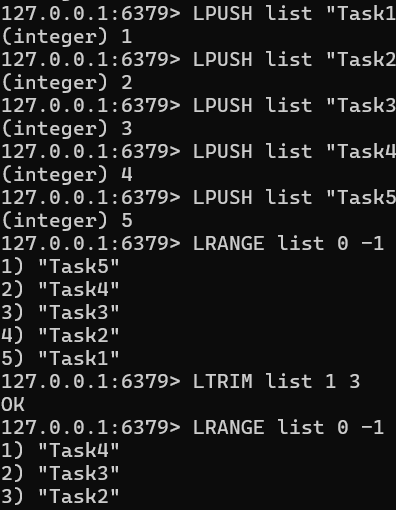
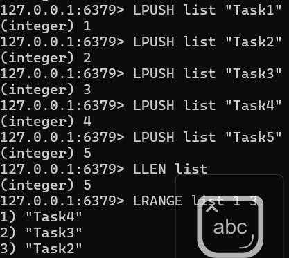
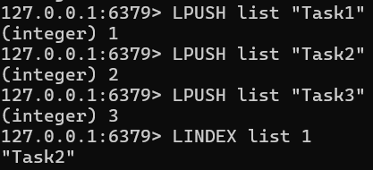
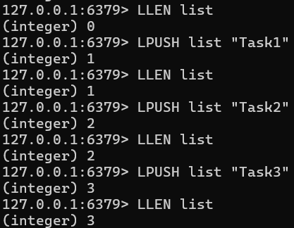
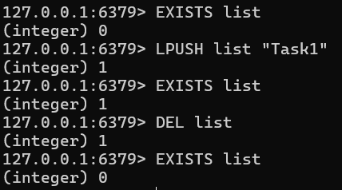

# Redis 데이터 타입 List 처리

## 데이터 삽입

```
LPUSH list "Task1"
LPUSH list "Task2"
LPUSH list "Task3"
LRANGE list 0 -1
```



## 데이터 추출

```
LPUSH list "Task1"
LPUSH list "Task2"
LPUSH list "Task3"
LRANGE list 0 -1
LPOP list
LPOP list
LPOP list
LPOP list
```



## 특정 범위만큼 리스트 자르기

```
LPUSH list "Task1"
LPUSH list "Task2"
LPUSH list "Task3"
LPUSH list "Task4"
LPUSH list "Task5"
LRANGE list 0 -1
LTRIM list 1 3
LRANGE list 0 -1
```



## 특정 범위만큼 리스트 조회

```
LPUSH list "Task1"
LPUSH list "Task2"
LPUSH list "Task3"
LPUSH list "Task4"
LPUSH list "Task5"
LLEN list
LRANGE list 1 3
```



## 특정 인덱스 위치의 데이터 조회

```
LPUSH list "Task1"
LPUSH list "Task2"
LPUSH list "Task3"
LINDEX list 1
```



## 리스트 길이 조회

```
LLEN list
LPUSH list "Task1"
LLEN list
LPUSH list "Task2"
LLEN list
LPUSH list "Task3"
LLEN list
```



## 리스트 존재 여부 조회

```
EXISTS list
LPUSH list "Task1"
EXISTS list
DEL list
EXISTS list
```

