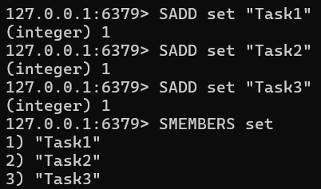
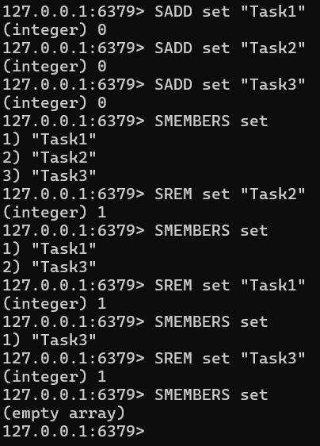
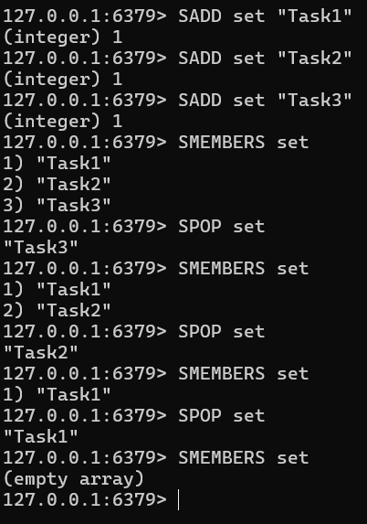
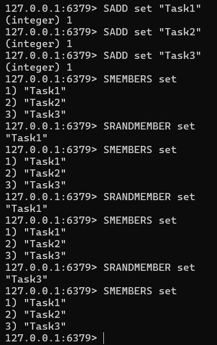
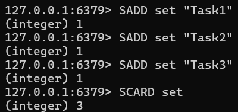
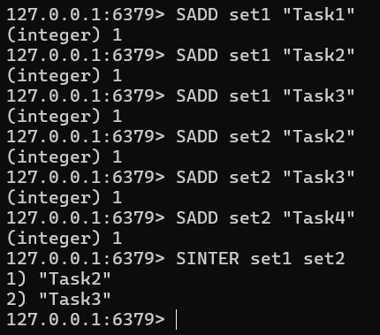
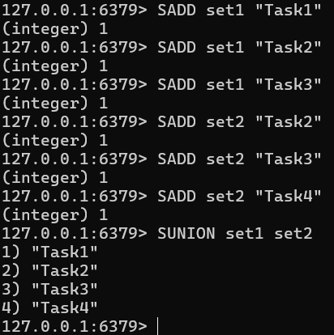
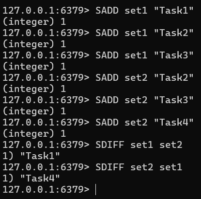

# Redis 데이터 타입 Set 처리

## 데이터 추가

```
SADD set "Task1"
SADD set "Task2"
SADD set "Task3"
SMEMBERS set
```



## 데이터 제거

```
SADD set "Task1"
SADD set "Task2"
SADD set "Task3"
SMEMBERS set
SREM set "Task2"
SMEMBERS set
SREM set "Task1"
SMEMBERS set
SREM set "Task3"
SMEMBERS set
```



## 랜덤 데이터 반환 (제거 O)

```
SADD set "Task1"
SADD set "Task2"
SADD set "Task3"
SMEMBERS set
SPOP set
SMEMBERS set
SPOP set
SMEMBERS set
SPOP set
SMEMBERS set
```



## 랜덤 데이터 반환 (제거 X)

```
SADD set "Task1"
SADD set "Task2"
SADD set "Task3"
SMEMBERS set
SRANDMEMBER set
SMEMBERS set
SRANDMEMBER set
SMEMBERS set
SRANDMEMBER set
SMEMBERS set
```



## 데이터 조회

```
SADD set "Task1"
SADD set "Task2"
SADD set "Task3"
SMEMBERS set
```


## 데이터 개수 조회

```
SADD set "Task1"
SADD set "Task2"
SADD set "Task3"
SCARD set
```



## 두 Set의 교집합 조회

```
SADD set1 "Task1"
SADD set1 "Task2"
SADD set1 "Task3"
SADD set2 "Task2"
SADD set2 "Task3"
SADD set2 "Task4"
SINTER set1 set2
```



## 두 Set의 합집합 조회

```
SADD set1 "Task1"
SADD set1 "Task2"
SADD set1 "Task3"
SADD set2 "Task2"
SADD set2 "Task3"
SADD set2 "Task4"
SUNION set1 set2
```



## 두 Set의 차집합 조회

```
SADD set1 "Task1"
SADD set1 "Task2"
SADD set1 "Task3"
SADD set2 "Task2"
SADD set2 "Task3"
SADD set2 "Task4"
SDIFF set1 set2
SDIFF set2 set1
```


