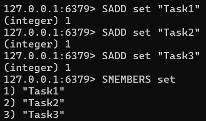
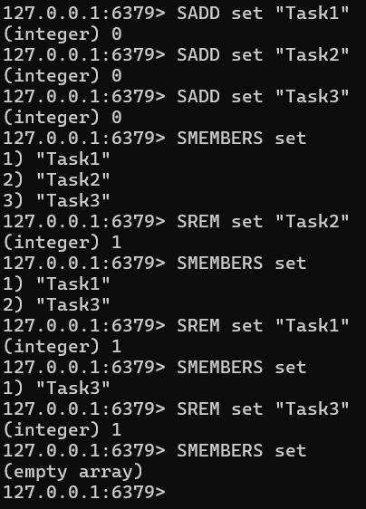
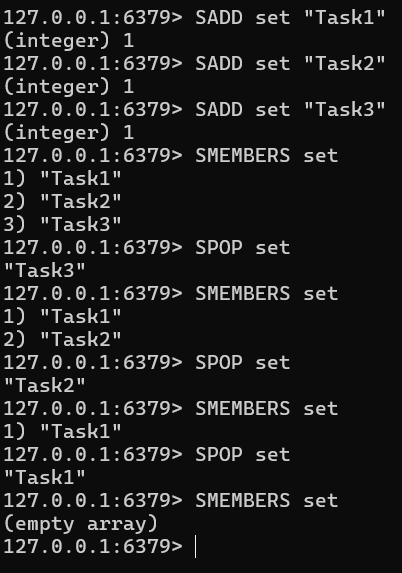
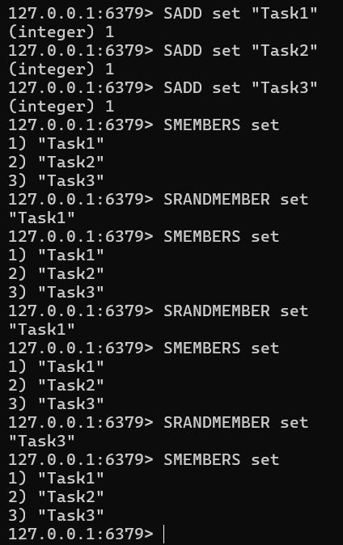
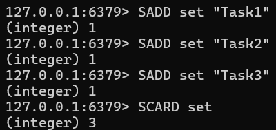
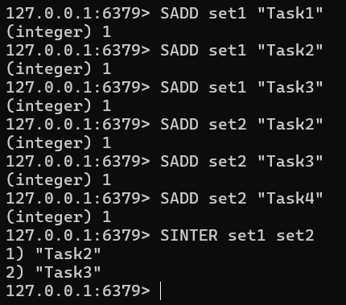
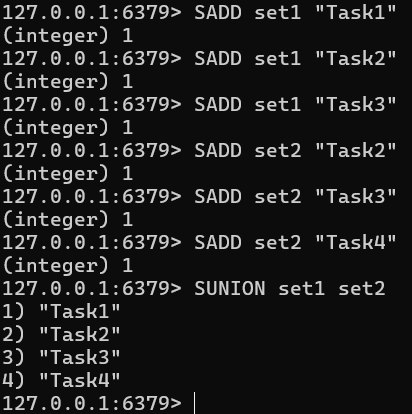
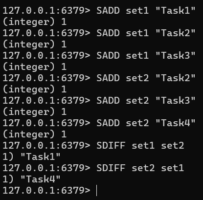

# Redis 데이터 타입 Set

## 특징

- 데이터 중복 허용 안함
- 순서가 존재하지 않는다
- 두 개의 Set을 통해 집합 연산 지원

## 용도

- **고유 데이터 관리** : 중복 없이 사용자 ID나 이메일 같은 데이터를 관리하기에 용이하다
- **블랙리스트/화이트리스트 관리** : 중복 없이 특정 IP나 사용자를 차단하는데 사용 가능하다
- **고유 방문자 수** : 각 방문자의 IP 주소를 Set에 추가해서 중복 없이 고유 방문자 수 추적 가능하다
- **분산 락** **: 여러 클라이언트가 동시에 리소스에 접근하는 것을 방지 가능하다
- **캐싱**
- **팔로우/팔로잉 목록**
- **이벤트 참여자 관리**

## 사용법

### 데이터 추가 (SADD)

```
SADD set "Task1"
SADD set "Task2"
SADD set "Task3"
SMEMBERS set
```



### 데이터 제거 (SREM)

```
SADD set "Task1"
SADD set "Task2"
SADD set "Task3"
SMEMBERS set
SREM set "Task2"
SMEMBERS set
SREM set "Task1"
SMEMBERS set
SREM set "Task3"
SMEMBERS set
```



### 랜덤 데이터 반환 (제거 O) (SPOP)

```
SADD set "Task1"
SADD set "Task2"
SADD set "Task3"
SMEMBERS set
SPOP set
SMEMBERS set
SPOP set
SMEMBERS set
SPOP set
SMEMBERS set
```



### 랜덤 데이터 반환 (제거 X) (SRANDMEMBER)

```
SADD set "Task1"
SADD set "Task2"
SADD set "Task3"
SMEMBERS set
SRANDMEMBER set
SMEMBERS set
SRANDMEMBER set
SMEMBERS set
SRANDMEMBER set
SMEMBERS set
```



### 데이터 조회 (SMEMBERS)

```
SADD set "Task1"
SADD set "Task2"
SADD set "Task3"
SMEMBERS set
```


### 데이터 개수 조회 (SCARD)

```
SADD set "Task1"
SADD set "Task2"
SADD set "Task3"
SCARD set
```



### 두 Set의 교집합 조회 (SINTER)

```
SADD set1 "Task1"
SADD set1 "Task2"
SADD set1 "Task3"
SADD set2 "Task2"
SADD set2 "Task3"
SADD set2 "Task4"
SINTER set1 set2
```



### 두 Set의 합집합 조회 (SUNION)

```
SADD set1 "Task1"
SADD set1 "Task2"
SADD set1 "Task3"
SADD set2 "Task2"
SADD set2 "Task3"
SADD set2 "Task4"
SUNION set1 set2
```



### 두 Set의 차집합 조회 (SDIFF)

```
SADD set1 "Task1"
SADD set1 "Task2"
SADD set1 "Task3"
SADD set2 "Task2"
SADD set2 "Task3"
SADD set2 "Task4"
SDIFF set1 set2
SDIFF set2 set1
```


