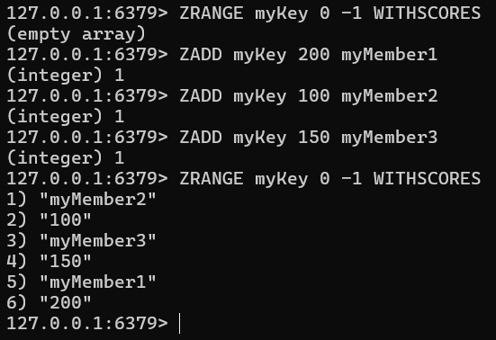
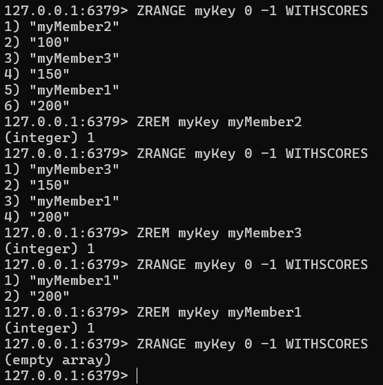
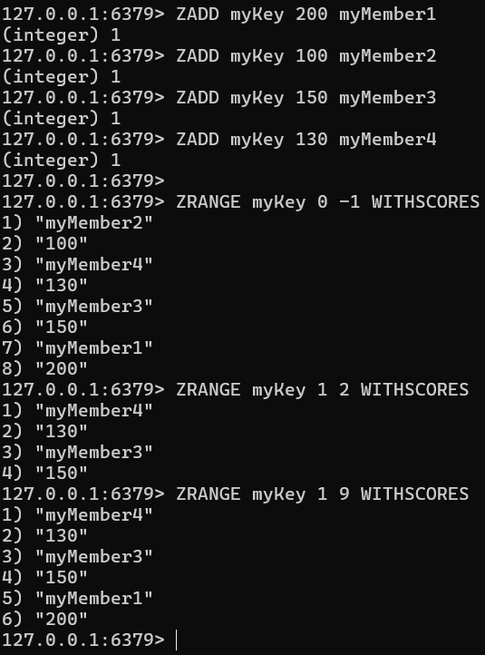
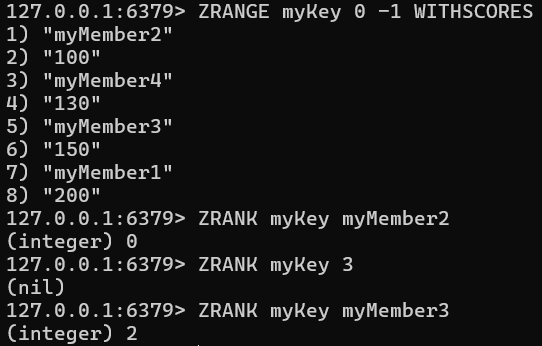
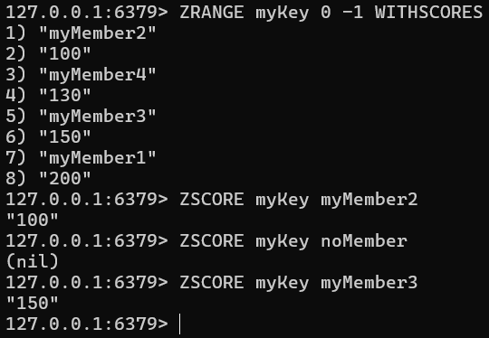
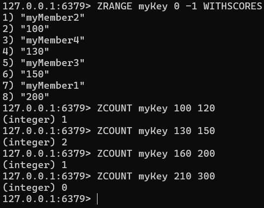
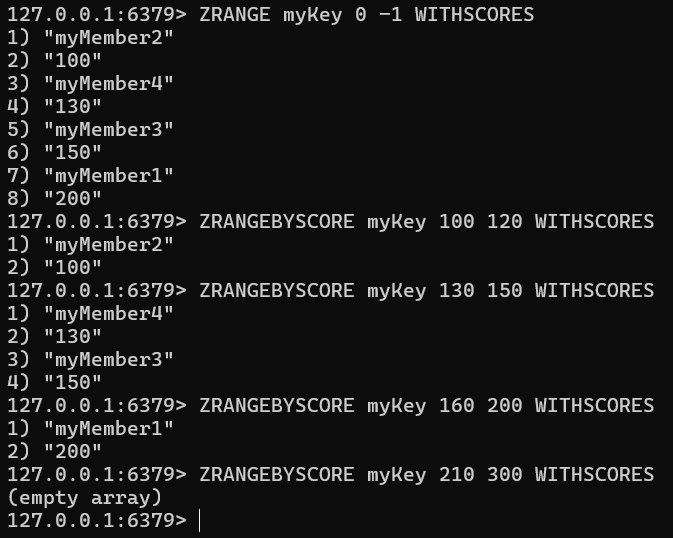
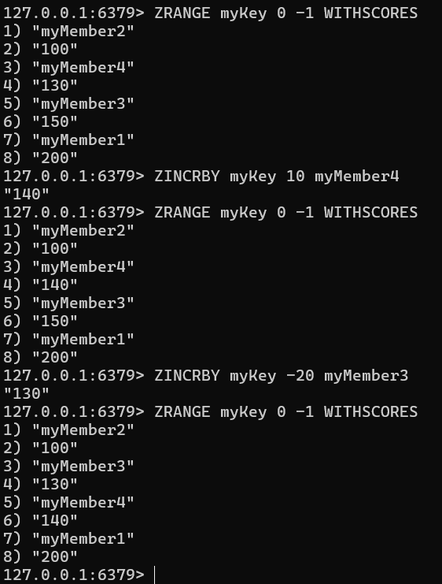

# Redis 데이터 타입 SortedSet

## 특징

- 유니크한 멤버와 점수를 함께 저장하는 데이터 구조
- 각 멤버의 점수를 통해서 순위를 매겨 멤버를 다룰 수 있다

## 용도

1. **리더 보드** : 멤버의 점수가 변동될 때 자동으로 정렬되므로, 별도의 정렬 로직이 필요 없다
2. **실시간 인기 검색어 랭킹** : 검색어가 입력될 때 마다 점수를 증가시키고, 가장 인기 있는 검색어를 정렬된 상태로 유지한다
3. **주식/암호화폐 실시간 가격 변동 순위** : 실시간 가격 변동이 잦은 주식, 암호화폐 시장에서 가장 큰 변동률을 보이는 종목을 업데이트 가능하다
4. **광고/마케팅 트래킹** : 광고 클릭 수를 점수로 사용하여 가장 효과적인 광고를 자동 정렬한다
5. **뉴스 피드** : 특정 기준(좋아요, 댓글 수, 공유 수)을 점수로 활용하여 인기 게시물을 자동 정렬한다
6. **IoT 데이터 스트림 분석** : 실시간으로 들어오는 센서의 데이터를 점수로 활용하여 변화량을 정렬한다

## 사용법
 
### 멤버 추가 (ZADD)

```
ZADD myKey 200 myMember1
ZADD myKey 100 myMember2 
ZADD myKey 150 myMember3
ZRANGE myKey 0 -1 WITHSCORES
```



### 멤버 삭제 (ZREM)

```
ZRANGE myKey 0 -1 WITHSCORES
ZREM myKey myMember2
ZRANGE myKey 0 -1 WITHSCORES
ZREM myKey myMember3
ZRANGE myKey 0 -1 WITHSCORES
ZREM myKey myMember1
ZRANGE myKey 0 -1 WITHSCORES
```



### 범위 내 멤버 조회 (ZRANGE)

```
ZADD myKey 200 myMember1
ZADD myKey 100 myMember2
ZADD myKey 150 myMember3
ZADD myKey 130 myMember4
ZRANGE myKey 0 -1 WITHSCORES
ZRANGE myKey 1 2 WITHSCORES
ZRANGE myKey 1 9 WITHSCORES
```



### 특정 멤버의 순위 조회 (ZRANK)

```
ZRANGE myKey 0 -1 WITHSCORES
ZRANK myKey myMember2
ZRANK myKey 3
ZRANK myKey myMember3
```



### 특정 멤버의 점수 조회 (ZSCORE)

```
ZRANGE myKey 0 -1 WITHSCORES
ZSCORE myKey myMember2
ZSCORE myKey noMember
ZSCORE myKey myMember3
```



### 특정 점수 범위 내 멤버 개수 조회 (ZCOUNT)

```
ZRANGE myKey 0 -1 WITHSCORES
ZCOUNT myKey 100 120
ZCOUNT myKey 130 150
ZCOUNT myKey 160 200
ZCOUNT myKey 210 300
```



### 특정 점수 범위 내 멤버 조회 (ZRANGEBYSCORE)

```
ZRANGE myKey 0 -1 WITHSCORES
ZRANGEBYSCORE myKey 100 120 WITHSCORES
ZRANGEBYSCORE myKey 130 150 WITHSCORES
ZRANGEBYSCORE myKey 160 200 WITHSCORES
ZRANGEBYSCORE myKey 210 300 WITHSCORES
```



### 특정 멤버의 점수 증감 (ZINCRBY)

```
ZRANGE myKey 0 -1 WITHSCORES
ZINCRBY myKey 10 myMember4
ZRANGE myKey 0 -1 WITHSCORES
ZINCRBY myKey -20 myMember3
ZRANGE myKey 0 -1 WITHSCORES
```

