# Redis 데이터 타입 문자열 처리

## 문자열 저장

```
SET key1 "HELLO world!"
GET key1
```

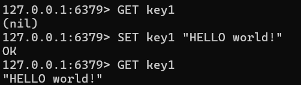

## 문자열 업데이트

```
SET key1 "HELLO"
GET key1
APPEND key1 " world!"
GET key1
```

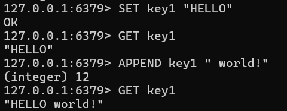

## 문자열 제거

```
SET key1 "HELLO world!"
GET key1
DEL key1
GET key1
```

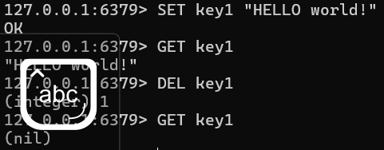

## 문자열 길이

```
SET key1 "Hello"
STRLEN key1
```

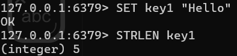

## 부분 문자열 추출

```
SET key1 "Hello World!"
GETRANGE key1 0 4
GETRANGE key1 6 -2
```

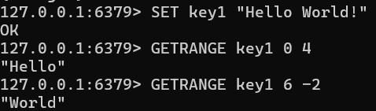

## 키가 없을 경우에만 초기화

```
SETNX key1 "value1"
GET key1
SETNX key1 "value2"
GET key1
```

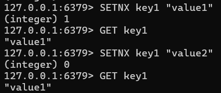

## 숫자 카운팅

```
SET counter 0
GET counter
INCR counter
GET counter
INCRBY counter 3
GET counter
DECR counter
GET counter
DECRBY counter 3
GET counter
```

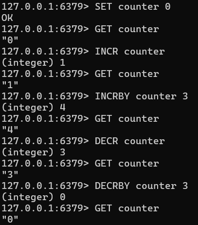

## TTL 설정

```
SET session_key "abc123" EX 5
TTL session_key
GET session_key
```

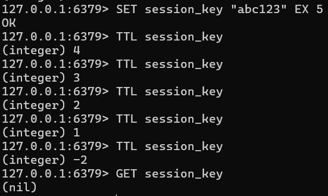

## JSON 문자열 처리

```
SET user:1 '{"id" : 1, "name" : "Alice", "age" : 25}'
GET user:1
SET user:1 '{"id" : 1, "name" : "Alice", "age" : 26}'
GET user:1
```

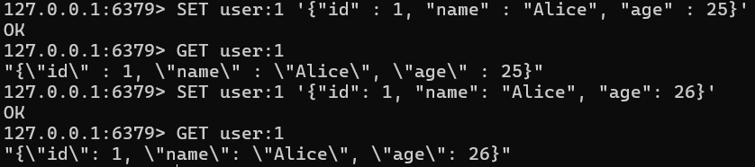

## OTP 코드 발급

```
SET user:1:otp_code "123456" EX 30
GET user:1:otp_code
TTL user:1:otp_code
```

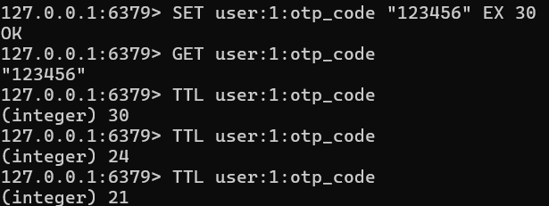

## 최근 방문 시간 업데이트

```
SET user:1:last_visit "2025-01-28 10:00:00"
GET user:1:last_visit
SET user:1:last_visit "2025-01-28 10:01:23"
GET user:1:last_visit
```

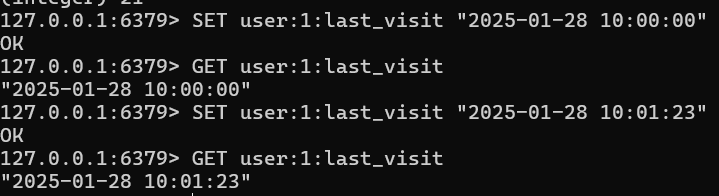

## 작업 요청 횟수 제한

```
SET user:1:remain_login 5
DECR user:1:remain_login
GET user:1:remain_login
```

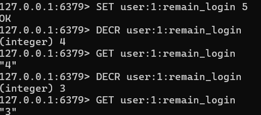