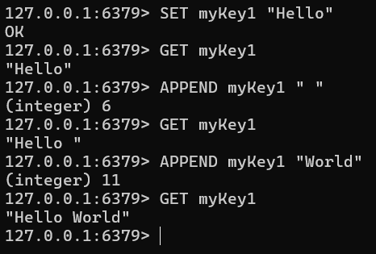

# Redis 명령어 키에 문자열 값 추가 (APPEND)

## 특징

- APPEND는 기존 문자열 데이터에 값을 추가할 때 사용한다.
- 존재하지 않는 키에 사용 시 새 키를 생성한다.
- 숫자 연산에는 부적합하다. (INCR 사용 권장)
- 긴 문자열을 자주 변경할 경우 성능 저하가 유발될 수 있다.
- 로그 저장 등 간단 용도로 활용 가능하나 List를 사용하는 것을 권장한다.
- 문자열을 단순 추가하는 용도로는 사용 가능하나, 성능 문제 및 데이터 관리 이슈로 잘 사용되지 않는 명령어다.

```
SET myKey1 "Hello"
GET myKey1
APPEND myKey1 " "
GET myKey1
APPEND myKey1 "World"
GET myKey1
```

