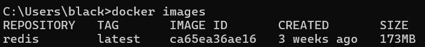
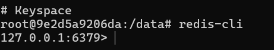

# Redis 설치 (Docker 환경)

## Redis 이미지 설치

```
docker pull redis:latest
docker images
```



## Redis 실행

```
docker run -d -p 6379:6379 -v C:\workspace\lab-redis\data:/data --name docker_redis redis 
docker ps
docker exec -it docker_redis /bin/bash
redis-cli
```

